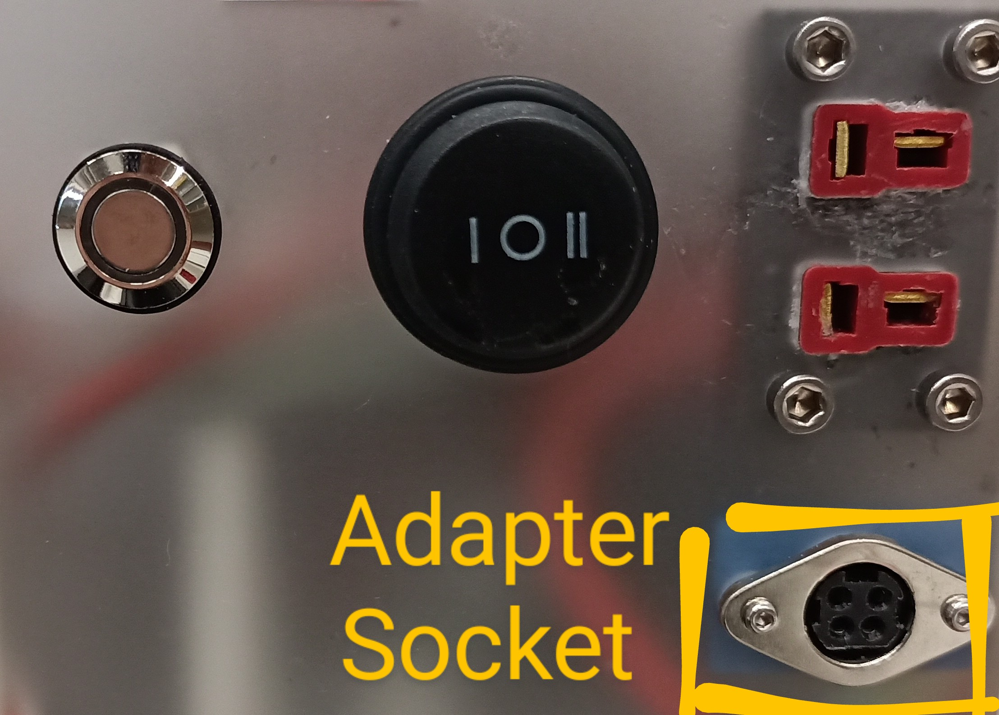
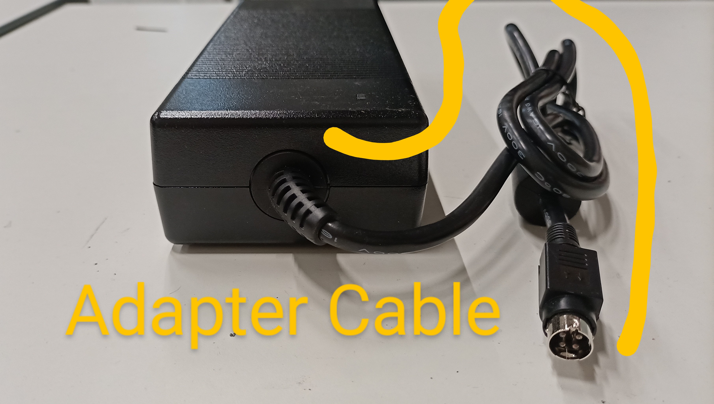
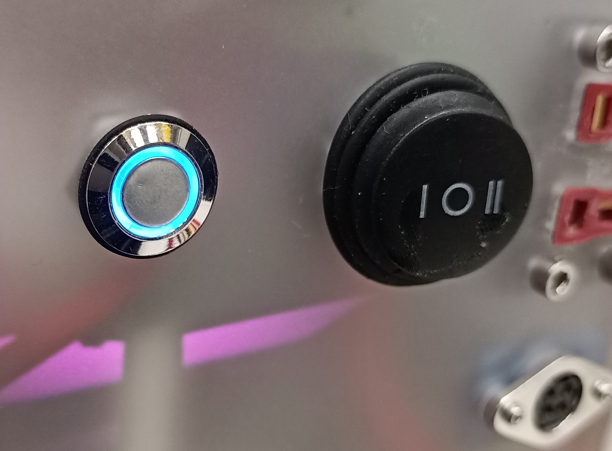
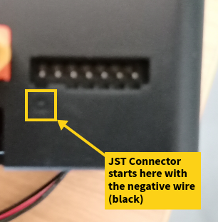
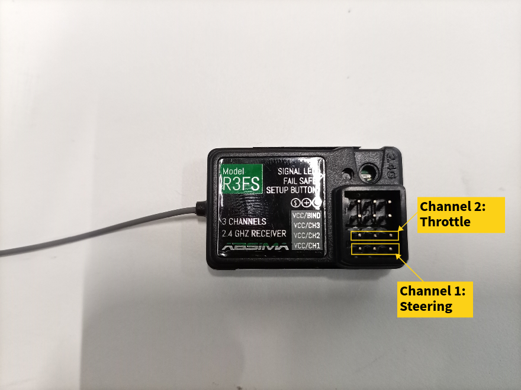
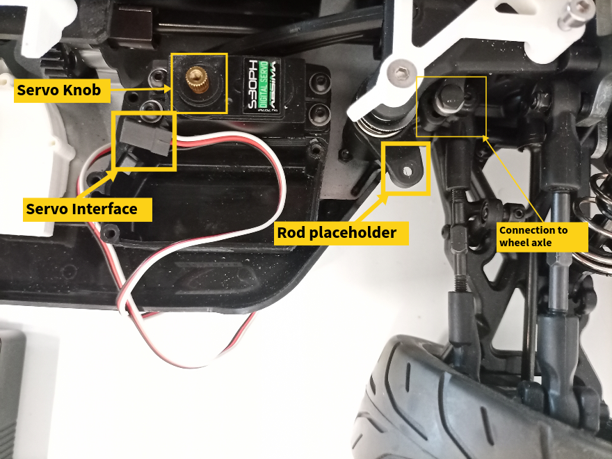
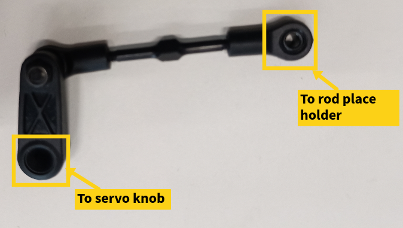
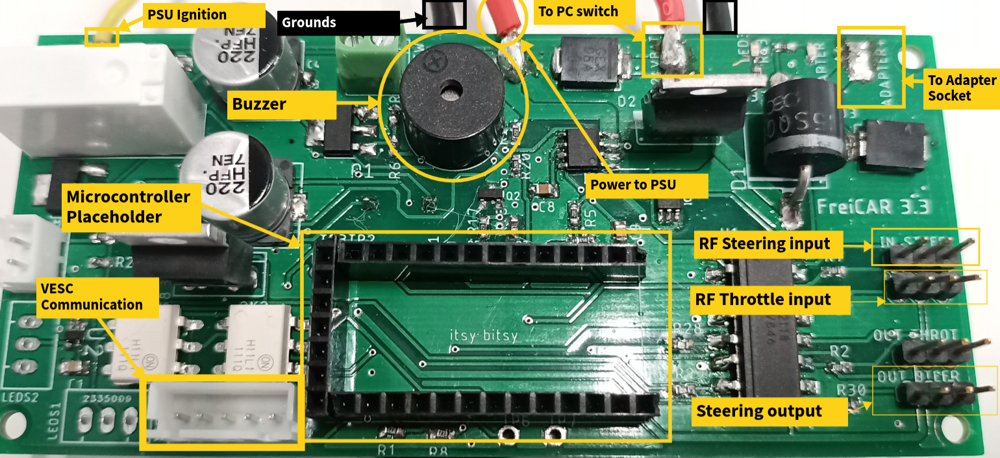
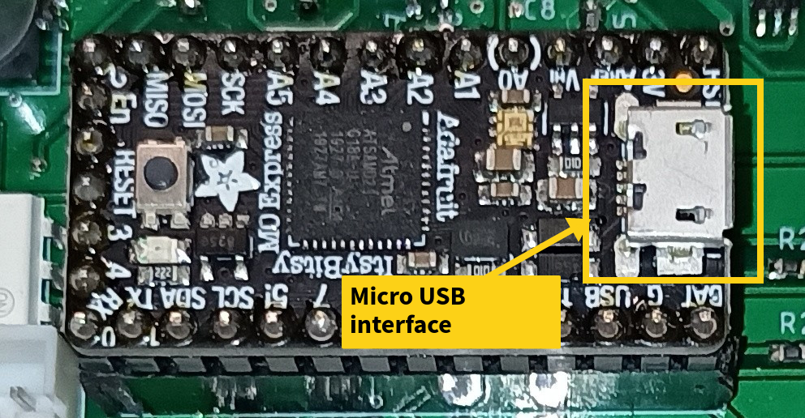

# FreiCar hardware documentation

# Usage

## **Powering On:**

*Power Panel*

- Hold the motor button down for 1 ~ 2 seconds until it lights blue.
- Switch the PC switch to *I* state or alternatively connect the adapter cable
    
    
    
- The panel should look like below after powering on

## **Charging:**

Photo of the charger

Photo of channels

*Balancer connection*

**Steps**

- Connect the dean plugs and the balancer cables for both battery systems
- Click the task button
- Select channel 1 or 2
- Select a current of 2 ampere (recommended is: 25% of battery capacity)
- Number of cells is detected automatically
- Repeat with the second channel
- Click on the channel button again to get back to the two channels view
- There is a percentage indicator for the charging state on the top right.
- The charger decreases the charging current gradually as the charging process approaches its end.

**Background Information**

*Balancing*

Each lithium ion battery has a number of cells, that are connected in series. The balancer cable gives the charger information about the voltage levels of the individual cells. The charger makes sure that the cells are always approximately equal when in balancer charging mode.

*Nominal Voltage*

The PC battery has 6 cells with 3.7 nominal voltage each, that sums to a total of 22.2 volts.

The 2 motor batteries combined have 4 cells with 3.7 nominal voltage each, that sums to a total of 14.8 volts.

*Maximum and minimum voltages*

Minimum: The individual cells level shouldn’t fall below 3 volts.

Maximum: The individual cells level shouldn’t exceed 4,2 volts.

**Attention**

If you connect an unbalanced battery directly to your system, there is a big risk of it dying beyond repair.

**Troubleshooting**

Check the orientation of the balancer cable and its position.

Check that the battery cables are solidly connected from both sides.

Check that the individual batteries didn’t drop too low.

# Documentation

## **Powering System**

- For switching check *switches and buttons.*
- For more information about the batteries check the *battery system*

**PC**

*Power Path*: The PC power pass through the base board, which powers the PSU, which in turn powers the motherboard.

*Power Source*: 

The power comes from either the PC battery or an adapter connected to an ac plug.

The adapter overrides the PC battery when connected and powers on the base board.

**Motor**

*Power Path:* The motor power pass through the anti-spark switch which powers the VESC, which in turns control the motor.

*Power Source:* Two li-po 7.4 volts batteries connected in series.

## Battery System**:**

There are two independent battery systems on the vehicle.

**PC battery**

The battery has 6 series li-po cells with a total nominal voltage of 22.2 volts.

The PC battery poles are to be connected directly to the respective poles of the charger through the charging dean socket.

**Motor batteries**

There are 2 motor batteries, each with 2 series li-po cells, connected in series. The total nominal voltage is 14.8 volts.

The positive pole of one battery and the negative pole of the other are connected directly to the charger respective poles through the charging dean socket.

The remaining poles are connecting the two batteries together.

## **Switches and Buttons**

There are two independent switches on the vehicle. One to turn on the PC and the other to turn on the motor.

**PC**

The PC switch connects or disconnects the PC battery +ve pole to or from the base board. Note that the negative pole is always connected to the ground of the board to close the circuit accordingly.

**Motor**

The motor button connects or disconnects the anti-spark switch device. The later device is directly connecting the external battery poles underlined in the *battery system* description to the VESC -Electronic speed controller- device. The VESC is in turn connected to the vehicle throttle motor.

## **Joystick controller and receiver**

- The RF receiver has two channels. These are connected to the base board. The two channels are marked on the board as throttle and steering.

- The base board outputs the processed input signals to the throttle motor through communication with the VESC and directly to the servo motor.

**Joystick**

- First turn the joystick on by sliding the switch to the on state.
- There exists three analog knobs on the joystick. These set an initial offset for steering, the steering sensitivity, and an initial offset for the throttle.

- The large side analog knob controls the steering of the vehicle. Rotate it to left or right to rotate the wheel axle accordingly.
    
    
- The trigger sends throttle signals:
    - Pull the trigger to move the vehicle forward.
    - Push it to the front to move the vehicle in reverse.
    - Velocity is controlled by how far you push or pull.

## Servo Motor

The servo motor has a rotating knob. A plastic flat rod is fitted on top of knob to connect the servo to the wheel axle mechanically.

To set the neutral angle of the wheel axle:

- Remove the plastic rod from the knob.
- Turn on the car to know the neutral state of the knob
- Rotate the wheel axle to the desired position.
- Reconnect the plastic rod. The rod can be elongated or shortened by rotating it around its axis.

## **System description**

The vehicle can be controlled by an RF joystick. It has a base board to route power, send and receive control signals. It additionally has an electronic speed controller that manages the higher power needed to run the motor by receiving the communication signal from the base board.

**Components Functionalities**

**Base board**

- An itsy-bitsy arduino microcontroller is mounted on it for processing and controlling signals.
- It has a buzzer for raising different alarms.
- It receives the input throttle and steering signals from the *RF* controller.
- It sends the output communication signal to the *electronic speed controller*.
- It send the output steering signal to the *servo motor*.
- It is the first routing stage for the input power (Adapter or *PC battery through the switch*).
- It sends the ignition signal and power to the *PSU*.
- It has a current measurement circuit (not currently used)

**Arduino Microcontroller**

- It is mounted on the base board and connected to the PC using USB.
- It is responsible for processing the communication signal sent to the *electronic speed controller*.
- It controls the buzzer alarm system.
    - It raises an alarm with a certain frequency for a dropped communication with the *electronic speed controller*.
    - It raises a lower frequency alarm for warning against low battery charge state.

**Motherboard**

- It is the interface for all the PC components and the GPU.

**PSU**

- It routes different levels of power to the motherboard through two groups of cables:
    - 24 pin power connector.
    - 4 pin 12 volts for the fan.
- It switches on the motherboard through a two jumper switch.
