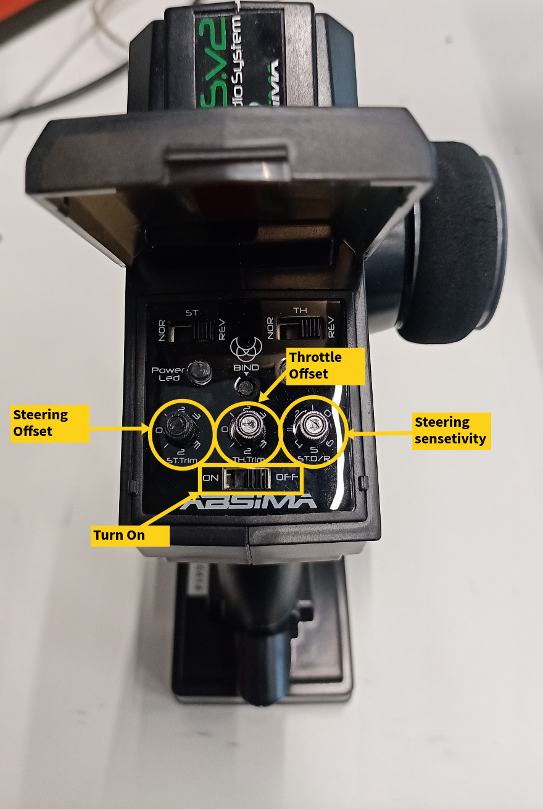
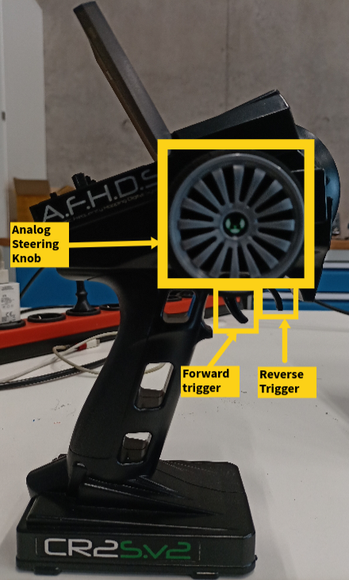

# Remote Control

- Before doing anything, open the controller cover and turn all trim knobs to a zero state to prevent miscalibration from the start.
- Next, turn the controller on by sliding the power switch to the ON state.
- There exists three analog knobs on the controller. These set an initial offset for steering, the steering sensitivity, and an initial offset for the throttle.

- The large side analog knob controls the steering of the vehicle. Rotate it to left or right to rotate the wheel axle accordingly.
    
    
- The trigger sends throttle signals:
    - Pull the trigger to move the vehicle forward.
    - Push it to the front to move the vehicle in reverse.
    - Velocity is controlled by how far you push or pull.