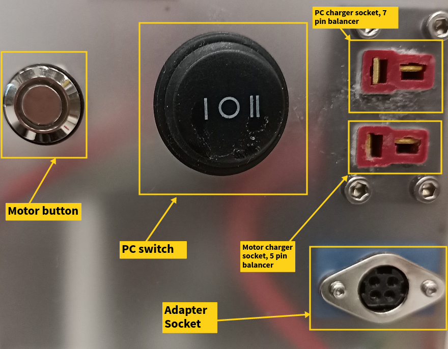
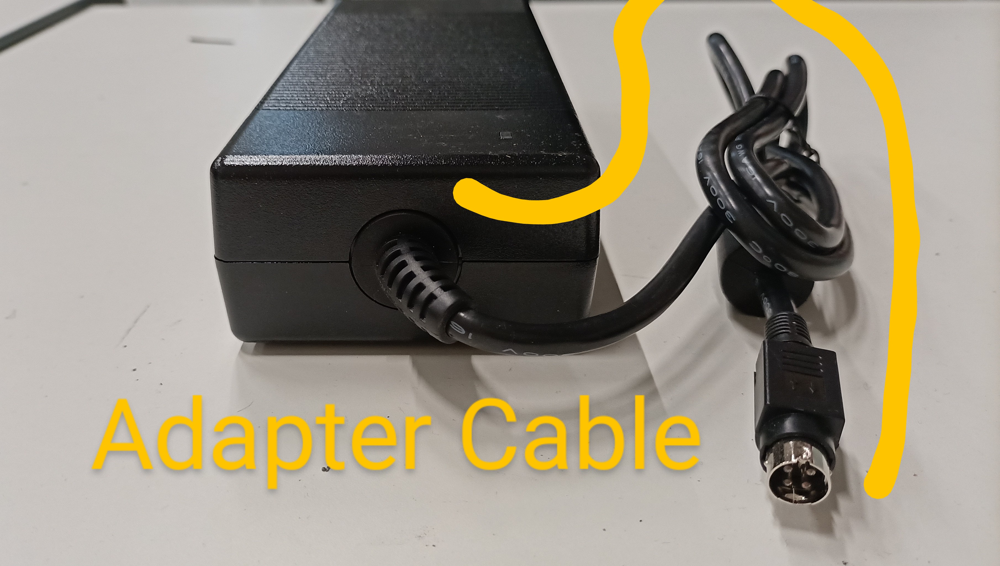
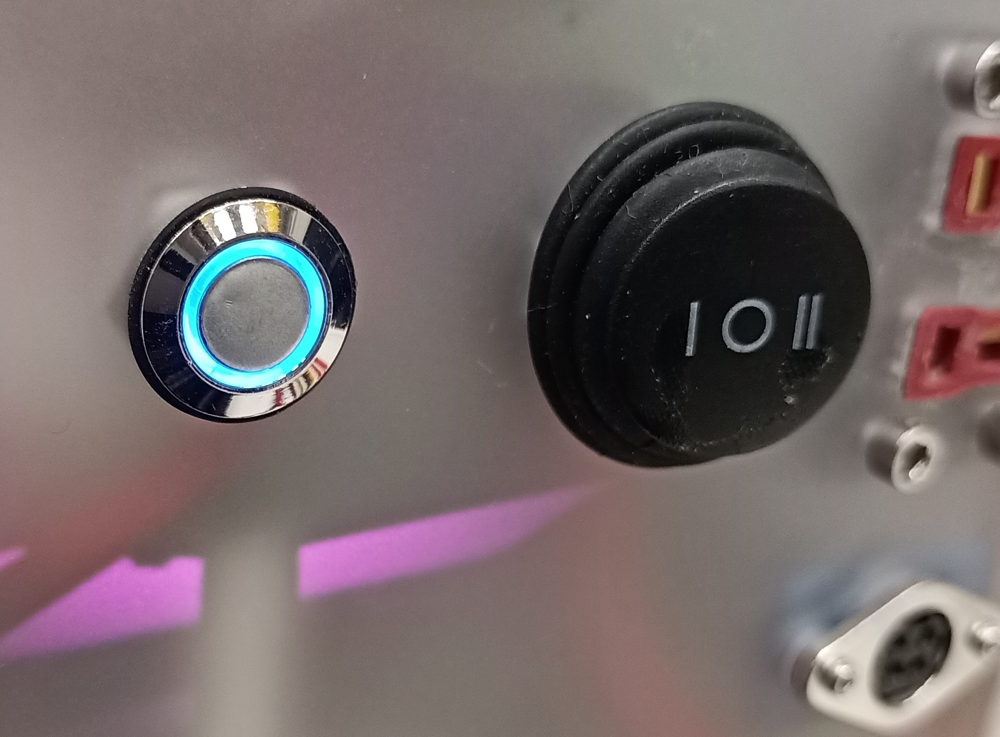
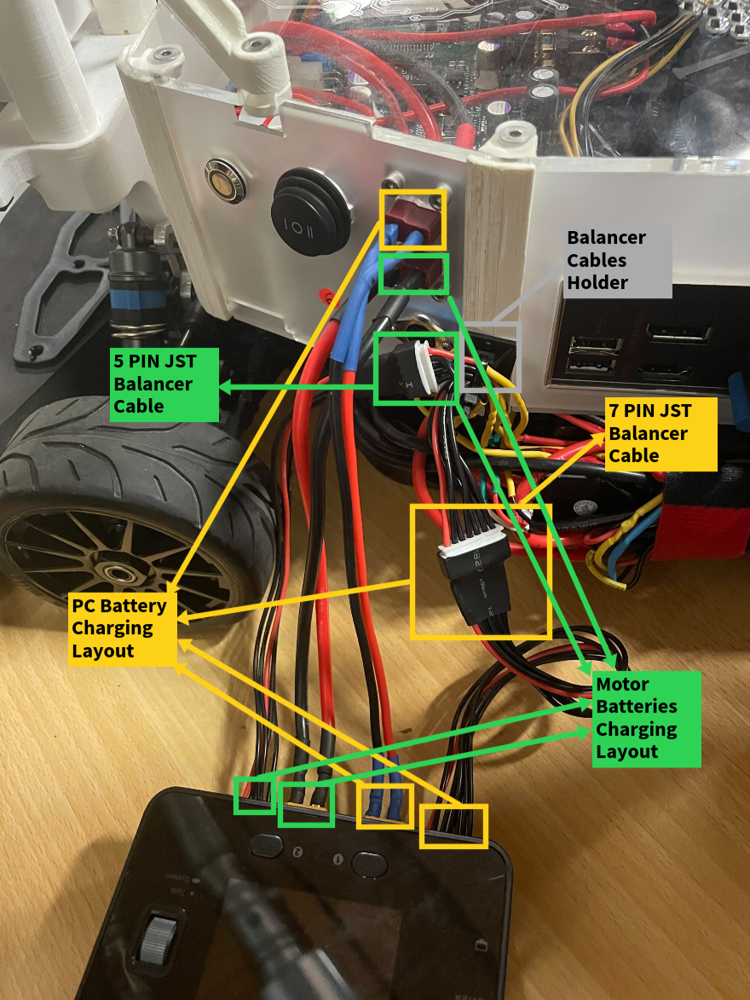
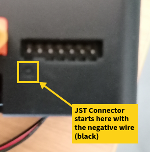
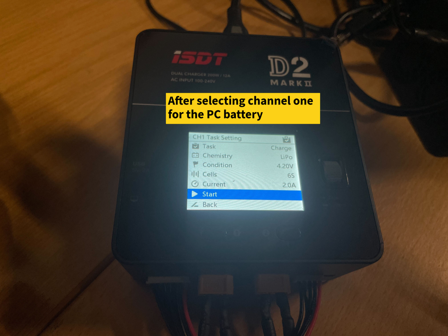
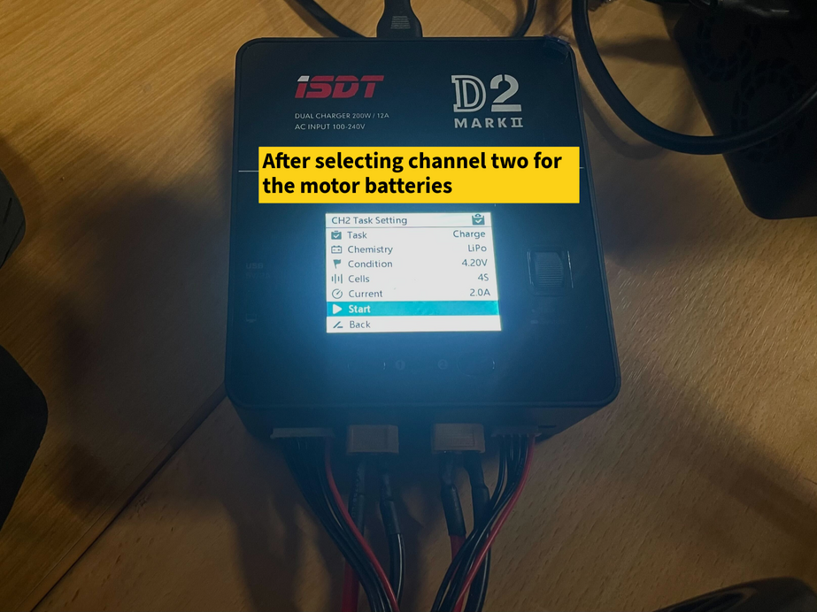

# Starting and Charging the Real Cars

## **Powering on**

*Power Panel*

- Hold the motor button down for 1 ~ 2 seconds until it lights blue.
- Switch the PC switch to *I* state or alternatively connect the adapter cable. Note that *II* state is unused.
    
    
    
- The panel should look like below after powering on.

**Attention!**

- Turn the car's corresponding [*remote control*](/remote) (radio transmitter) on <strong>before</strong> powering on the car. This is to avoid any sudden movements due to the car's radio receiver receiving noise signals without proper communication with the transmitter.

## **Charging**

*Charging Overview*

*Balancer connection*  

**Steps**
<ol>
<li>Connect the dean plugs and the balancer cables for both battery systems.</li>
<li>Click the task button.</li>
<li>Select channel 1 or 2.</li>
<li>Select a current of 2 A (recommended is: 25% of battery capacity).</li>
<li>Make sure the number of cells is 4 for the motor batteries and 6 for the PC battery.</li>
<li>Make sure the task is charge</li>
<li>Use the task scroller to navigate to 'Start' and select it.</li>
<li>Repeat with the second channel.</li>
<li>Click on the channel button again to get back to the two channels view.</li>
<li>There is a percentage indicator for the charging state on the top right.</li>
<li>The charger decreases the charging current gradually as the charging process approaches its end.</li>
</ol>

The charger menu should look like the following

**Stop Charging**

When the batteries are fully charged, the respective channel color turns green followed by a blue tick, a short beep sound, then the charging stops.

To willingly stop the charging process:
<ol>
<li>Select the target channel.</li>
<li>Use the task scroller to navigate to 'Stop' and select it.</li>
</ol>

**Background Information**

*Balancing*: Each lithium ion battery has a number of cells, that are connected in series. The balancer cable gives the charger information about the voltage levels of the individual cells. The charger makes sure that the cells are always approximately equal when in balancer charging mode.

*Nominal Voltage*: The *PC battery* has 6 cells with 3.7 V nominal voltage each, that sums to a total of 22.2 V. The 2 *motor batteries* combined have 4 cells with 3.7 V nominal voltage each, that sums to a total of 14.8 V.

*Maximum and minimum voltages*: The individual cells level shouldn’t fall below 3 V and shouldn’t exceed 4.2 V.

**Attention!**

- If you connect an unbalanced battery directly to your system, there is a big risk of it dying beyond repair.
- Do not leave the car charging unattended.

**Troubleshooting**

- Check the layout of the balancer cables and the dean plugs.
- Check that the battery cables are solidly connected from both sides.
- Check that the individual battery cells didn’t drop too low.

## **PC Power Hotswapping**
- To switch the PC power source from the PC battery to the adapter:
    <ol>
     <li>Keep the PC switch on *I* state.</li>
     <li>Connect the adapter cable.</li>
     <li>Switch the PC to *O* state.</li>
    </ol>
- To switch the PC power source from the adapter to the PC battery:
    <ol>
    <li>Keep the adapter connected.</li>
    <li>Switch the PC to *I* state.</li>
    <li>Disconnect the adapter.</li>
    </ol>

## **Turn off Alarms**
- Missing communication between the PC and the motor (higher frequency alarm):
    The motor turns itself off automatically approximately every 20 minutes. This results in a lost communication between the PC and the motor. To stop the alarm, hold the motor button down for 1~2 seconds until it lights blue again.
- Low battery (lower frequency alarm):
    Power off the car and charge it.

## **Powering off**

**Steps**
<ol>
<li>Shut down the PC via SSH.</li>
<li>Switch the PC to *O* state or disconnect the adapter.</li>
<li>Press the motor button for 1~2 seconds until the blue light disappears.</li>
</ol>

**Attention!**

- Turn the car's corresponding [*remote control*](/remote) (radio transmitter) off <strong>after</strong> powering off the car. This is to avoid any sudden car movements due to the car's radio receiver receiving noise signals without proper communication with the transmitter.

